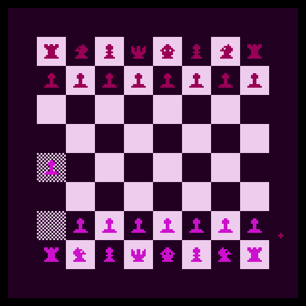

# uxn-chess
## introduction
I have started this project as a fun way to try out [chibicc](https://github.com/lynn/chibicc) - "a small c compiler for [uxn](https://100r.co/site/uxn.html)".

Therefore the base code is written in C with mappings to uxn provided by chibicc such as `set_screen_addr`.


## how to run
### chibicc
To run this app you need [chibicc](https://github.com/lynn/chibicc), from there you can run
```
./run.sh PATH_TO_YOUR_CHESS_UXN/chess.c
```

### uxnemu
Alternatively you can just run the rom provided in this repository with uxn emulator (I have tried it with `uxnemu`) or compile the TAL source code with `uxnasm`

Information on how to run uxn programs can be found on [100 rabbits page](https://100r.co/site/uxn.html).

### In a browser
If you don't want to deal with uxnemu or chibicc locally you can go to https://metasyn.srht.site/learn-uxn/ and use `io > import rom` and select rom file from this repository

## what is implemented
- [x] board drawn
- [x] pieces drawn
- [x] keep order - first white pieces, then black, and so on
- [ ] standard moves - IN PROGRESS (pawns, knights ready)
- [ ] special moves - en passant, pawn promotion, castles
- [ ] check
- [ ] check mate
- [ ] game restart

## screenshots



